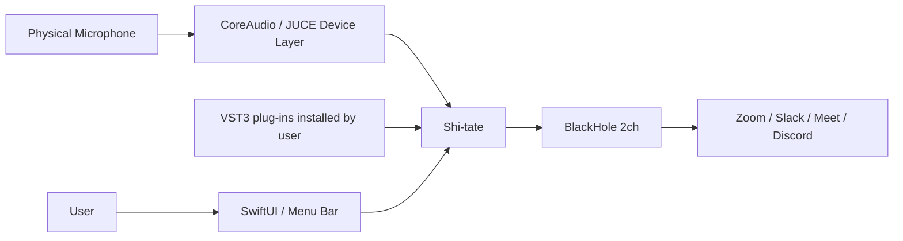
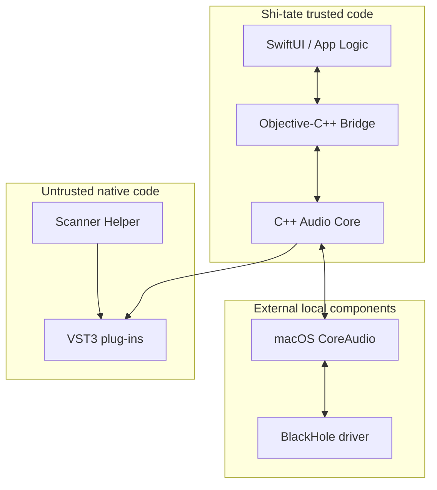
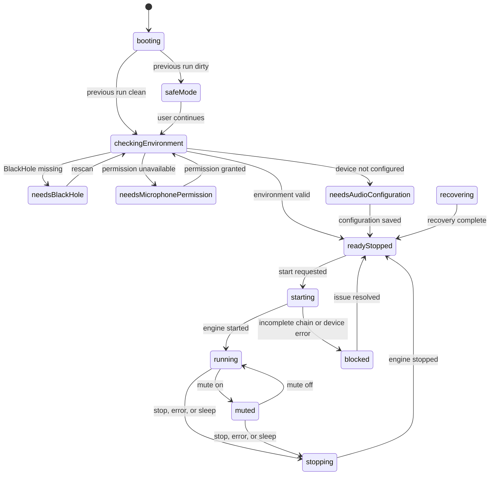
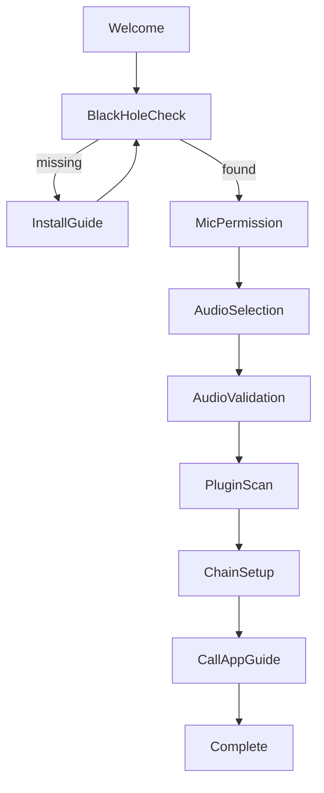

# Shi-tate Detailed Design

> **Tailor your voice before it reaches the call.**
>
> Shi-tate (Shitate / 仕立て) is an open-source Audio Input FX host for macOS.
> It processes a physical microphone through a user-selected VST3 effect chain
> and routes the processed signal to Zoom, Slack, Google Meet, Discord, and
> similar applications through BlackHole.

---

## 0. Document information

| Field | Value |
|---|---|
| Document | Shi-tate Detailed Design |
| Document version | 1.0.0 |
| Created | 2026-08-06 |
| Target release | Shi-tate v0.1.0 |
| Status | Ready for implementation |
| Product name | **Shi-tate** |
| Canonical code name | **Shitate** |
| Japanese name | **仕立て** |
| Repository | `hokupod/shitate` |
| License | `AGPL-3.0-only` |

This document fixes the decisions required for the MVP so implementation does
not branch on unresolved product choices. Anything explicitly described as a
future capability is excluded from v0.1.0.

### 0.1 Normative language

- **MUST** indicates a v0.1.0 completion requirement.
- **SHOULD** indicates the normal implementation. An omission requires a
  documented ADR.
- **MAY** indicates an optional capability that is not a completion gate.

---

## 1. Product definition

### 1.1 Problem

Online meetings in offices and shared spaces capture nearby speech, HVAC noise,
and keyboard sounds. Built-in suppression differs between communication apps
and cannot provide a personal, composable VST3 processing chain.

Shi-tate applies user-selected VST3 effects in series before the microphone
signal reaches a communication app.

```text
Physical microphone
  ↓
Shi-tate
  ├─ Expander / Gate
  ├─ Noise Suppression
  ├─ EQ
  ├─ Compressor
  └─ Limiter
  ↓
BlackHole 2ch
  ↓
Zoom / Slack / Google Meet / Discord
```

### 1.2 Name

The Japanese word 仕立て means tailoring material for a particular person or
purpose. Shi-tate lets a person tailor a microphone signal to their voice,
workspace, hardware, and calling needs by composing a VST3 chain.

### 1.3 Tagline

- Japanese: **通話の手前で、声を仕立てる。**
- English: **Tailor your voice before it reaches the call.**

### 1.4 Canonical README introduction

```markdown
# Shi-tate

Shi-tate (Shitate / 仕立て) is an open-source VST3 audio input FX host for macOS.
It processes a physical microphone through a personal effect chain and routes
the result to communication apps via BlackHole.

The Japanese word 仕立て means tailoring something for a particular person or
purpose. Shi-tate lets you tailor your microphone signal before it reaches the call.
```

---

## 2. Goals and non-goals

### 2.1 v0.1.0 goals

1. Select one channel from a physical microphone on an Apple Silicon Mac.
2. Convert the selected mono signal to stereo dual mono.
3. Process up to eight serial VST3 Audio Effects.
4. Route the processed signal to BlackHole 2ch output channels 1 and 2.
5. Use that signal in a communication app that selects BlackHole 2ch as its
   microphone.
6. Protect the main app from VST3 crashes and hangs during scanning.
7. Start in safe mode without automatically restoring VST3 after a crash.
8. Fail closed to silence without selecting another device after microphone or
   BlackHole disconnection, sleep, or another invalidating event.
9. Require no administrator privilege, shell execution, bundled custom driver,
   audio recording, or telemetry.
10. Support source and binary distribution under AGPLv3 obligations.

### 2.2 v0.1.0 non-goals

The following are not implemented:

- a custom virtual audio driver;
- downloading, installing, updating, or bundling BlackHole;
- VST2, Audio Unit, AUv3, CLAP, LV2, or AAX;
- Windows, Linux, or Intel Mac support;
- Rosetta or a separate Intel-only VST3 bridge;
- speaker identification, speaker separation, or owner-voice extraction;
- a bundled AI noise-suppression model;
- sidechain input;
- MIDI input, MIDI effects, or software instruments;
- 5.1, Atmos, or other multichannel layouts;
- real-time headphone monitoring;
- recording, playback, or audio-file persistence;
- plug-in purchasing, redistribution, or a marketplace;
- an automatic updater;
- automatic crash-report or usage-statistics upload;
- network remote control; and
- full runtime plug-in process isolation.

---

## 3. Fixed design decisions

| ID | Topic | Decision |
|---|---|---|
| D-001 | License | `AGPL-3.0-only` |
| D-002 | UI | Swift 6 and SwiftUI |
| D-003 | Audio core | C++20 and JUCE 9.0.0 |
| D-004 | Language boundary | Thin Objective-C++ bridge; never expose JUCE directly to Swift |
| D-005 | CPU | Apple Silicon `arm64` only |
| D-006 | Minimum OS | macOS 14.0 deployment target |
| D-007 | Primary validation OS | macOS 26.x |
| D-008 | Build | CMake is the only source of truth and uses the Xcode generator |
| D-009 | Toolchain | Xcode 26.6, Swift 6.3, language mode 6 |
| D-010 | Plug-in format | VST3 Audio Effect only |
| D-011 | Chain | Serial 2-in/2-out, maximum eight slots |
| D-012 | Scan isolation | One helper process per plug-in bundle |
| D-013 | Runtime | VST3 runs in the main process in v0.1 |
| D-014 | Virtual device | External BlackHole 2ch dependency |
| D-015 | Standard format | 48,000 Hz, Float32, 256 frames |
| D-016 | Resampling | None in v0.1; a device without 48 kHz cannot start |
| D-017 | Clocking | JUCE 9 private aggregate device is the primary mode |
| D-018 | Failure | Fail closed; no implicit device fallback |
| D-019 | Persistence | Swift JSON plus VST3 state binary; never persist audio |
| D-020 | App Sandbox | Disabled; Hardened Runtime enabled |
| D-021 | Library Validation | Explicitly disabled for third-party VST3 |
| D-022 | Updates | Manual GitHub Releases download; no in-app updater |
| D-023 | App networking | None |
| D-024 | Start at launch | Off by default; only an explicit user preference can enable it |

JUCE is pinned to exactly:

```text
Version: 9.0.0
Commit:  f8f8864172464b9adf9eba6101e1f784838d1597
```

Repository development uses a Nix flake to provide missing command-line tools
such as CMake and format/check utilities reproducibly. Xcode remains an external
Apple dependency and is selected through `DEVELOPER_DIR` or the system developer
directory. The flake MUST NOT replace the pinned Apple compiler or SDK.

---

## 4. Users and primary use cases

### 4.1 Users

- People who join online meetings on macOS.
- People using USB microphones, audio interfaces, or a built-in microphone.
- People who want existing VST3 effects on microphone input.
- People who want a lightweight menu-bar host instead of launching a DAW.

### 4.2 Primary use cases

#### UC-001 First-time setup

1. Launch Shi-tate.
2. Verify that BlackHole 2ch exists.
3. Grant microphone permission.
4. Select an input device and input channel.
5. Scan VST3 plug-ins.
6. Build an effect chain.
7. Start routing.
8. Select BlackHole 2ch as the microphone in the communication app.

#### UC-002 Daily use

1. Shi-tate launches at login if explicitly configured.
2. The user starts routing, or an explicit preference permits automatic start.
3. The user checks input state in the menu bar.
4. The user toggles mute with the global shortcut during a call.
5. After the call, the user leaves the app resident or stops routing.

#### UC-003 Edit a VST3 chain

1. Stop routing, or let the app perform a safe stop.
2. Add, remove, or reorder VST3 effects.
3. Configure a plug-in in its native editor.
4. Save the session.
5. Resume routing.

#### UC-004 Recover from a crash

1. The app terminates unexpectedly while running VST3 code.
2. The next launch detects a dirty run state.
3. The app enters safe mode without loading VST3.
4. It identifies the most likely suspect slot.
5. The user restores one slot at a time or disables the suspect.

---

## 5. System context



### 5.1 Trust boundaries



A valid signature does not make native VST3 behavior safe. Scanning is isolated
in a helper process, but runtime VST3 executes with the main app's permissions.
The README and onboarding MUST disclose this boundary.

---

## 6. Technology stack

### 6.1 Development environment

```yaml
platform: macOS
host_architecture: arm64
minimum_deployment_target: "14.0"
primary_test_os: "26.x"
xcode: "26.6"
swift_compiler: "6.3"
swift_language_mode: "6"
cpp_standard: "C++20"
cmake_minimum: "3.31"
juce:
  version: "9.0.0"
  commit: "f8f8864172464b9adf9eba6101e1f784838d1597"
blackhole:
  supported_device: "BlackHole 2ch"
  tested_baseline: "0.6.1"
```

The repository provides `flake.nix` and `flake.lock` for command-line tooling.
It does not package Xcode, macOS SDKs, BlackHole, or any third-party VST3.

### 6.2 JUCE modules

Use only:

```text
juce_core
juce_events
juce_data_structures
juce_graphics
juce_gui_basics
juce_gui_extra
juce_audio_basics
juce_audio_devices
juce_audio_processors
juce_audio_utils
```

Compile definitions disable unused hosts, media, and network features:

```cmake
JUCE_PLUGINHOST_VST3=1
JUCE_PLUGINHOST_VST=0
JUCE_PLUGINHOST_AU=0
JUCE_PLUGINHOST_LADSPA=0
JUCE_PLUGINHOST_LV2=0
JUCE_USE_CURL=0
JUCE_WEB_BROWSER=0
JUCE_USE_FLAC=0
JUCE_USE_OGGVORBIS=0
JUCE_USE_MP3AUDIOFORMAT=0
JUCE_USE_LAME_AUDIO_FORMAT=0
JUCE_USE_CDREADER=0
JUCE_USE_CDBURNER=0
JUCE_USE_CAMERA=0
```

### 6.3 Swift and C++ boundary

Although modern Swift supports C++ interoperability, JUCE makes extensive use
of templates, virtual classes, reference types, and nontrivial ownership. v0.1
does not expose JUCE directly to Swift.

Swift-visible values are limited to Foundation-compatible types:

- `NSString`, `NSNumber`, `NSData`, `NSArray`, and `NSDictionary`;
- Objective-C enums and lightweight DTOs;
- completion handlers and delegates.

Real-time buffers, JUCE types, C++ containers, ownership, and C++ exceptions do
not cross the bridge.

---

## 7. Process and bundle structure

```text
Shi-tate.app/
└─ Contents/
   ├─ MacOS/
   │  └─ Shitate
   ├─ Helpers/
   │  └─ ShitatePluginScanner
   ├─ Resources/
   │  ├─ Assets.car
   │  ├─ LICENSE
   │  └─ THIRD_PARTY_NOTICES.md
   ├─ Info.plist
   └─ _CodeSignature/
```

CMake target, module, and executable names use `Shitate`. Only the distributed
application name is `Shi-tate.app`.

### 7.1 Main process

Responsibilities: SwiftUI, menu bar, settings/session persistence, CoreAudio
device control, real-time audio processing, runtime VST3, native VST3 editors,
and safe mode.

### 7.2 Scanner helper

Each launch inspects exactly one `.vst3` bundle. It enumerates classes, accepts
Audio Effects only, checks arm64 support, negotiates 2-in/2-out, prepares at
48 kHz with 512 frames, processes silence and impulse blocks, rejects NaN/Inf,
and returns metadata. It never opens an audio device or UI.

### 7.3 Runtime isolation

v0.1 runs VST3 in the main process for latency and implementation scope.
Known limits:

- an access violation can terminate the app;
- a plug-in can access files or the network with user permissions;
- a deadlock can stop the app; and
- safe mode protects the next launch, not continued processing after a crash.

Swift C++ interoperability introduced in Swift 5.9 does not change this
boundary; the shipped language mode remains Swift 6.

---

## 8. Application state machine

### 8.1 States

```swift
enum ApplicationState: Equatable {
    case booting
    case safeMode(SafeModeReason)
    case checkingEnvironment
    case needsBlackHole
    case needsMicrophonePermission
    case needsAudioConfiguration
    case readyStopped
    case starting
    case running
    case muted
    case stopping
    case recovering
    case blocked(BlockingIssue)
    case fatal(AppError)
}
```

### 8.2 Transitions



### 8.3 Automatic start conditions

Routing may start automatically only when all conditions hold:

1. `startRoutingAtLaunch == true`;
2. the previous shutdown was clean;
3. safe mode is inactive;
4. BlackHole exists;
5. the saved input UID exists unchanged;
6. input and output support 48 kHz;
7. all plug-ins exist and match signature/fingerprint;
8. every plug-in state restores; and
9. the session has no unresolved error.

Otherwise routing stays stopped and the UI explains why.

---

## 9. Audio architecture

### 9.1 Signal path


`OutputSafetyProcessor` owns only finite-value replacement, denormal flushing,
and clamping. `MasterOutputStage` owns mute and start/stop ramps exactly once.

### 9.2 DeviceService

`DeviceService` owns `juce::AudioDeviceManager` and handles device enumeration,
UID/display name, channel counts/names, sample rates, buffer sizes, change
notifications, private aggregate lifecycle, xrun count, and actual format.

### 9.3 Device selection

- Input is one user-selected channel on a physical microphone.
- Output defaults to a device named `BlackHole 2ch`.
- Persistence and comparison use CoreAudio UID, never display name.
- Equal names with different UIDs are different devices.

If BlackHole is absent, the app links only to its official installation guide.
It never downloads, installs, executes an installer, or selects another output.

### 9.4 Private aggregate device

The primary routing mode uses JUCE 9's private CoreAudio aggregate:

```text
Clock device: BlackHole 2ch
Drift-compensated device: Physical microphone
```

BlackHole provides the output clock; drift compensation handles the independent
physical input clock. Shipped configurations MUST create a private aggregate.

### 9.5 Manual aggregate fallback

If private aggregate creation fails, the user can explicitly create an
aggregate in Audio MIDI Setup containing the physical microphone and BlackHole,
choose BlackHole as clock source, enable drift correction on the microphone,
select the same aggregate for input/output, and select the correct input and
BlackHole output-channel offsets. The app stores those offsets and never switches
into this mode automatically.

### 9.6 Format negotiation

```yaml
preferred_sample_rate: 48000
preferred_buffer_frames: 256
allowed_buffer_frames: [128, 256, 512]
maximum_callback_frames: 1024
plugin_maximum_block_frames: 512
internal_channels: 2
sample_format: float32
```

Rules:

1. Input and output must share 48 kHz.
2. Prefer 256 frames, then 128, then 512.
3. Reject any other configured buffer size.
4. Prepare VST3 at a maximum of 512 frames.
5. Split callbacks of 513–1024 frames into consecutive chunks no larger than
   512 while preserving meter, plug-in, and ramp continuity.
6. Silence callbacks over 1024 frames and request control-thread recovery.
7. v0.1 does not resample. Devices that cannot run at 48 kHz are unsupported.

AirPods and other microphones that cannot operate at 48 kHz are outside the
official v0.1 compatibility matrix.

### 9.7 AudioEngine

```cpp
class AudioEngine final : public juce::AudioIODeviceCallback {
public:
    Result configure(const AudioConfiguration&);
    Result start();
    void stop() noexcept;
    void setMasterMuted(bool) noexcept;
    bool isRunning() const noexcept;
    MeterSnapshot getMeterSnapshot() const noexcept;
    EngineDiagnostics getDiagnostics() const;
    void audioDeviceAboutToStart(juce::AudioIODevice*) override;
    void audioDeviceStopped() override;
    void audioDeviceError(const juce::String&) override;
    void audioDeviceIOCallbackWithContext(
        const float* const* inputChannelData, int numInputChannels,
        float* const* outputChannelData, int numOutputChannels,
        int numSamples,
        const juce::AudioIODeviceCallbackContext&) override;
};
```

### 9.8 Real-time callback order

`audioDeviceIOCallbackWithContext` performs the following order. Its first
frame guard is equivalent to `numSamples <= maximumCallbackFrames` before any
signal can reach output.

1. Clear every output channel.
2. Return unless the engine is running.
3. Validate frame count, configuration, pointers, and selected channels.
4. Split supported oversized callbacks as defined in §9.6.
5. Copy the selected mono input into a preallocated stereo working buffer.
6. Update the input meter.
7. Run `PluginChain::process`.
8. Inspect each slot's non-finite result.
9. Run `OutputSafetyProcessor`.
10. Run `MasterOutputStage` once.
11. Update the output meter.
12. Copy to BlackHole output channels 1 and 2.
13. Update callback-time EMA.

### 9.9 Real-time prohibitions

The callback MUST NOT call `new`, `delete`, `malloc`, or `free`; grow a
`std::vector`; perform file/JSON/log/network I/O; wait for `Mutex` or
`CriticalSection`; call Swift/Foundation/UI; create/destroy/serialize a plug-in;
or reconfigure a device. It may use preallocated buffers, atomics,
`processBlock`, finite checks, channel copies, meters, and ramps.

### 9.10 InputMapper

```cpp
class InputMapper {
public:
    void prepare(int maximumFrames);
    void mapMonoToDualMono(const float* source, int frames,
                           juce::AudioBuffer<float>& destination) noexcept;
};
```

Output is always two channels. Both receive the same sample. Null input becomes
silence. Input gain is fixed at 0 dB in v0.1.

### 9.11 PluginChain

Use a dedicated serial chain, not a general graph. It supports at most eight
slots and can be structurally changed only while the engine is stopped.

```cpp
class PluginChain {
public:
    static constexpr size_t maxSlots = 8;
    Result prepare(double sampleRate, int maxBlockSize);
    void releaseResources() noexcept;
    void process(juce::AudioBuffer<float>&, juce::MidiBuffer&) noexcept;
    Result addSlot(std::unique_ptr<HostedPluginSlot>);
    Result removeSlot(SlotId);
    Result moveSlot(SlotId, size_t destinationIndex);
    void setBypassed(SlotId, bool) noexcept;
};
```

### 9.12 HostedPluginSlot

```cpp
class HostedPluginSlot {
public:
    SlotId id() const noexcept;
    const PluginIdentity& identity() const noexcept;
    Result prepare(double sampleRate, int maxBlockSize);
    void process(juce::AudioBuffer<float>&, juce::MidiBuffer&) noexcept;
    void releaseResources() noexcept;
    void setBypassed(bool) noexcept;
    bool isBypassed() const noexcept;
    bool hasRuntimeFault() const noexcept;
    juce::MemoryBlock serializeState();
    Result restoreState(const void* data, size_t size);
};
```

Each slot has immutable identity, atomic bypass/fault flags, and a preallocated
2×512 backup. If active, it backs up the chunk, calls `processBlock` behind a
catch-all `try/catch (...)` C++ exception boundary, restores input on exception
or NaN/Inf, marks
one fault, and queues one coalesced UI event. Access violations, abort, and
deadlock are handled only by next-launch safe mode.

### 9.13 Output safety and master output

`OutputSafetyProcessor` is mandatory after all plug-ins and performs only:

- replacement of NaN and Inf with zero;
- denormal flushing; and
- hard clamp to `[-1.0, 1.0]`.

`MasterOutputStage` is mandatory after safety and solely owns:

- a 5 ms master-mute ramp;
- a 10 ms start fade-in; and
- a 10 ms stop fade-out.

Neither responsibility is duplicated. These stages are a final safety net, not
an audio-quality limiter.

### 9.14 Metering

Input and output each report peak/RMS dBFS, clipping, and signal presence with a
`-96 dBFS` floor. SwiftUI polls at 30 Hz while running; the audio thread never
generates high-frequency UI callbacks.

```cpp
struct MeterSnapshot {
    float inputPeakDb;
    float inputRmsDb;
    float outputPeakDb;
    float outputRmsDb;
    bool inputClipping;
    bool outputClipping;
};
```

### 9.15 Master mute

- Default shortcut: `Control + Shift + M`.
- Implement with Carbon `RegisterEventHotKey`; do not request Accessibility.
- Warn on conflict while preserving on-screen mute.
- Apply mute at final output, not before the chain.
- Continue processing and metering while muted; only output becomes zero.

---

## 10. VST3 compatibility

### 10.1 Requirements

A loadable v0.1 VST3 must be a macOS `.vst3` bundle; arm64 or Universal; an
Audio Effect; exactly 2-in/2-out on the main bus; 48 kHz capable; prepare with a
maximum block of 512; operate without sidechain; pass scanner silence/impulse,
timeout, crash, and non-finite checks; and satisfy signature policy.

### 10.2 Unsupported plug-ins

Instrument/Synth, MIDI Effect, analyzer without audio output, mono-only,
sidechain-required, Intel-only, multiple-main-bus-required, fixed 3+ channel,
or UI-required-during-scan plug-ins are rejected.

### 10.3 Search paths

```text
~/Library/Audio/Plug-Ins/VST3
/Library/Audio/Plug-Ins/VST3
```

Users may explicitly add absolute paths. Security-scoped bookmarks are not
needed because App Sandbox is disabled.

### 10.4 Identity

```text
PluginIdentity = canonical bundle path
               + VST3 class UID
               + code directory hash (cdhash)
               + architecture
```

`pluginFingerprint` is SHA-256 over the UTF-8 concatenation.

### 10.5 Signature policy

| Status | Default behavior |
|---|---|
| Valid Apple / Developer ID | Allow |
| Ad-hoc | Warn; allow only after explicit per-fingerprint approval |
| Unsigned | Reject |
| Invalid signature | Reject |
| cdhash changed after scan | Require rescan |

Use Security.framework (`SecStaticCodeCreateWithPath`,
`SecStaticCodeCheckValidityWithErrors`, `SecCodeCopySigningInformation`), never
`codesign` or a shell. Store signing/team identifiers, cdhash, flags, canonical
path, bundle version, and modification date.

### 10.6 Library Validation

The main app and scanner enable Hardened Runtime and disable Library Validation
to load third-party VST3:

```xml
<key>com.apple.security.cs.disable-library-validation</key>
<true/>
```

Because this weakens a platform defense, the independent signature/fingerprint
checks are mandatory.

---

## 11. Scanner helper design

### 11.1 Execution model

- Spawn one process for one plug-in bundle; never use a persistent scanner.
- Use shell-free `posix_spawn` with argument arrays. The approved v0.1
  implementation does not use `juce::ChildProcess`.
- Pass only `--request <request-json-path>` in argv, never the plug-in path.
- The parent owns PID lifecycle, timeout, termination, and exit classification.

```text
ShitatePluginScanner --request /private/tmp/shitate-scan-<uuid>/request.json
```

### 11.2 Temporary directory

```text
/private/tmp/shitate-scan-<uuid>/
├─ request.json
├─ result.json
├─ stdout.log
└─ stderr.log
```

The owned directory is mode `0700`; request and result files are `0600`. Remove
it after completion. On next launch, remove only owned, non-symlink task
directories with the exact prefix that are older than 24 hours.

### 11.3 Request schema

```json
{
  "protocolVersion": 1,
  "requestID": "UUID",
  "pluginBundlePath": "/Library/Audio/Plug-Ins/VST3/Example.vst3",
  "expectedCodeDirectoryHash": "hex",
  "sampleRate": 48000,
  "maximumBlockFrames": 512,
  "requiredLayout": {
    "inputChannels": 2,
    "outputChannels": 2
  }
}
```

Required fields, types, bounds, UUID/hash values, and protocol version are
strict. The request file must be owned by the current user and have safe mode.

### 11.4 Result schema

```json
{
  "protocolVersion": 1,
  "requestID": "UUID",
  "status": "compatible",
  "bundle": {
    "path": "/Library/Audio/Plug-Ins/VST3/Example.vst3",
    "codeDirectoryHash": "hex",
    "teamIdentifier": "TEAMID",
    "signatureKind": "developerID",
    "architectures": ["arm64"]
  },
  "plugins": [
    {
      "classUID": "hex",
      "name": "Example Compressor",
      "manufacturer": "Example",
      "version": "1.2.3",
      "category": "Fx",
      "inputChannels": 2,
      "outputChannels": 2,
      "latencySamples": 0,
      "hasEditor": true,
      "compatible": true,
      "reason": null
    }
  ],
  "durationMilliseconds": 734
}
```

Result size is bounded before parsing. Missing required fields, invalid types,
request-ID mismatch, invalid values, or unsupported protocol fail closed.
Unknown additive fields may be ignored.

### 11.5 Exit codes

| Code | Meaning |
|---:|---|
| 0 | Success; read the result |
| 10 | Invalid request |
| 20 | Invalid signature |
| 30 | Bundle load failure |
| 31 | Factory acquisition failure |
| 32 | No supported class |
| 40 | Result write failure |
| 50 | Internal error |

The parent additionally classifies signal termination as `crashed`, more than
20 seconds as `timedOut`, and a missing/invalid result as `invalidResult`. On
timeout it sends SIGTERM, waits a fixed short grace period, then sends SIGKILL
if required, and always reaps the child.

### 11.6 Scan sequence

1. Validate and parse request.
2. Canonicalize the plug-in path and compare it with the request.
3. Revalidate signature, cdhash, and architecture.
4. Load the VST3 bundle and enumerate every class.
5. Instantiate Audio Effect candidates only.
6. Set one 2-in/2-out main bus with no sidechain.
7. Prepare at 48 kHz with maximum 512 frames.
8. Process two silent blocks and one impulse block.
9. Reject NaN/Inf and collect latency/editor metadata.
10. Release the instance.
11. Write a temporary result and atomically `rename` it.
12. Exit with the exact code from §11.5.

The helper never opens an audio device or UI.

### 11.7 Catalog cache

Reuse a scan only when canonical path, cdhash, bundle modification date,
protocol version, and compatible Shi-tate major/minor all match. Any mismatch
invalidates the entry.

---

## 12. Runtime VST3 lifecycle

### 12.1 Session restoration

1. Confirm that `AudioEngine` is stopped.
2. Read `session.json`.
3. Resolve every fingerprint in the catalog.
4. Revalidate bundle existence, path, signature, cdhash, architecture, class,
   category, and layout immediately before loading.
5. Atomically write `loadingPlugin` to run state before instantiation.
6. Instantiate and configure exactly 2-in/2-out.
7. Restore the bounded plug-in state binary.
8. Prepare at 48 kHz / 512 frames.
9. Clear `loadingPlugin` only after success.
10. Permit engine start only after every slot succeeds.

### 12.2 Restoration failure

If any slot fails, mark the session incomplete and keep routing stopped. Offer
Retry, Rescan, Remove unavailable slot, and explicit
`Start without unavailable plug-ins`. The reduced chain is ephemeral and is
not automatically persisted.

### 12.3 Chain editing

Add, remove, and move perform: 10 ms fade-out → stop → save current state →
mutate → prepare every slot → start → 10 ms fade-in. v0.1 has no running hot
swap. A failed mutation leaves routing stopped and preserves the last valid
session description.

### 12.4 State persistence

Never call VST3 `getStateInformation` on the real-time thread. Save on explicit
`Save Session`, before chain mutation, when routing stops, and during clean quit.
Saving while running explicitly warns that audio will pause, fades and stops,
saves, prepares, and resumes only after success.

### 12.5 Editor windows

Create native editors with `createEditorIfNeeded()` and show one JUCE
`DocumentWindow` per slot. Do not embed editors in SwiftUI. Create/destroy on
the main thread, close before removing a slot or quitting, and clamp requested
sizes to `320x200` through `1600x1200`.

---

## 13. Swift, Objective-C++, and C++ boundary

### 13.1 Layers

```text
SwiftUI
  ↓ Objective-C API
STAudioEngineBridge / STPluginBridge
  ↓ Objective-C++ implementation
C++ ApplicationCore
  ↓
JUCE / VST3 / CoreAudio
```

### 13.2 Naming

Objective-C public types use the `ST` prefix, including
`STAudioEngineBridge`, `STAudioDeviceInfo`, `STPluginDescriptor`,
`STPluginSlotInfo`, `STEngineStatus`, and `STBridgeError`.

C++ uses namespace `shitate`; the Swift module is `ShitateApp`.

### 13.3 Bridge header example

```objc
#import <Foundation/Foundation.h>

NS_ASSUME_NONNULL_BEGIN

@class STAudioEngineBridge;
@class STAudioDeviceInfo;
@class STMeterSnapshot;

@protocol STAudioEngineBridgeDelegate <NSObject>
- (void)audioEngineBridge:(STAudioEngineBridge *)bridge
            didChangeState:(NSInteger)state;
- (void)audioEngineBridge:(STAudioEngineBridge *)bridge
          didReceiveError:(NSError *)error;
- (void)audioEngineBridgeDidChangeDevices:(STAudioEngineBridge *)bridge;
- (void)audioEngineBridge:(STAudioEngineBridge *)bridge
  didFaultPluginSlotWithID:(NSUUID *)slotID;
@end

@interface STAudioEngineBridge : NSObject
@property (nonatomic, weak, nullable) id<STAudioEngineBridgeDelegate> delegate;
- (instancetype)init NS_DESIGNATED_INITIALIZER;
- (NSArray<STAudioDeviceInfo *> *)inputDevices;
- (NSArray<STAudioDeviceInfo *> *)outputDevices;
- (BOOL)configureInputDeviceUID:(NSString *)inputUID
                   channelIndex:(NSInteger)channelIndex
                outputDeviceUID:(NSString *)outputUID
                     sampleRate:(double)sampleRate
                   bufferFrames:(NSInteger)bufferFrames
                          error:(NSError **)error;
- (BOOL)startWithError:(NSError **)error;
- (void)stop;
- (void)setMasterMuted:(BOOL)muted;
- (STMeterSnapshot *)meterSnapshot;
@end

NS_ASSUME_NONNULL_END
```

### 13.4 Implementation rules

- Objective-C++ uses `.mm`.
- Public headers expose no C++ types and use nullability annotations.
- Every public method catches C++ exceptions and maps them to `NSError`.
- Delegate/completion delivery is on the main queue, never the audio thread.
- Plug-in `NSData` state has copy ownership.
- Strings received from Swift are copied before the call returns.

### 13.5 Event delivery

C++ owns a fixed-length lock-free queue of engine-state, device-change,
plug-in-fault, xrun, and fatal-error events. A main-thread 50 ms timer drains it.
Equivalent events coalesce on overflow; a fatal event also has an atomic
fallback slot.

```cpp
enum class CoreEventType {
    engineStateChanged,
    devicesChanged,
    pluginFaulted,
    xrunDetected,
    fatalError
};
```

### 13.6 Swift AppModel

```swift
@MainActor
@Observable
final class AppModel: NSObject {
    private let bridge: STAudioEngineBridge
    var state: ApplicationState = .booting
    var inputDevices: [AudioDevice] = []
    var outputDevices: [AudioDevice] = []
    var slots: [PluginSlot] = []
    var meters: MeterSnapshot = .silence
    var isMuted = false
    func bootstrap() async
    func startRouting() async
    func stopRouting() async
    func toggleMute()
    func rescanPlugins() async
    func saveSession() async
}
```

`AppModel` owns bridge/services and is the authoritative UI model. Each bridge
callback hops to `MainActor` exactly once.

### 13.7 Meter polling

Poll at about 30 Hz (`Task.sleep` for approximately 33 ms) while `running` and
5 Hz while stopped. Cancel the `Task` during model teardown. Do not use
audio-thread callbacks for meters.

```swift
while !Task.isCancelled {
    meters = bridge.meterSnapshot().swiftValue
    try? await Task.sleep(for: .milliseconds(33))
}
```

---

## 14. SwiftUI and AppKit UI design

The product UI MUST follow Apple's current Human Interface Guidelines for
macOS: familiar native controls and interaction, system typography and colors,
clear hierarchy, keyboard navigation, meaningful labels, standard menus and
settings placement, adequate control sizing/spacing, and accessibility that
does not rely on color alone. Use visual restraint appropriate to a focused
audio utility; distinctiveness comes from clear signal-flow/status presentation,
not unfamiliar custom controls.

Normative reference:
<https://developer.apple.com/design/human-interface-guidelines>

### 14.1 App scenes

```swift
@main
struct ShitateApp: App {
    @State private var model = AppModel()
    var body: some Scene {
        WindowGroup("Shi-tate", id: "main") {
            MainView().environment(model)
        }
        MenuBarExtra("Shi-tate", systemImage: model.menuBarSymbol) {
            MenuBarView().environment(model)
        }
        Settings {
            SettingsView().environment(model)
        }
    }
}
```

The Settings command uses the standard App menu and Command-Comma. The settings
window uses stable panes in a noncustomizable toolbar, identifies the active
pane, restores the last pane, and does not duplicate task-specific controls.

### 14.2 Product surfaces

#### Dashboard

Show routing status, selected input/channel/output, actual sample rate and
buffer, host and plug-in latency separately, xrun count, input/output meters,
master mute, start/stop, and bypass-all.

#### Chain

Show eight bounded slots with name, manufacturer, version, drag reorder, Edit,
Bypass, Remove, fault status, latency, Add Plug-in, and Save Session.

#### Plugins

Show detected VST3, compatible/incompatible/blocked and manufacturer filters,
scan/signature status, rescan, folder management, per-item rescan, and explicit
ad-hoc fingerprint approval.

#### Audio Settings

Show input device/channel, output, automatic-private/manual-aggregate mode,
fixed 48 kHz, supported buffer choice, launch at login, start at launch,
`resumeAfterWake`, and global mute shortcut preference.

#### Diagnostics

Show app/commit/JUCE versions, device/format, xrun, callback CPU EMA/maximum,
truncated plug-in fingerprints, last error, Open Logs Folder, Copy Redacted
Diagnostics, and Reset Safe Mode.

#### About

Show Shi-tate / 仕立て, copyright, AGPL redistribution/modification and no-warranty
notices, source link, full license, and third-party notices.

### 14.3 Onboarding



Completion requires BlackHole output, microphone permission, selected input
device/channel, a working 48 kHz supported buffer, and a saved session. Zero
plug-ins is a valid passthrough onboarding path.

### 14.4 Menu bar

Use familiar SF Symbols for stopped, running, muted, warning, and fatal states.
The menu contains Open Shi-tate, Start/Stop Routing, Mute/Unmute, current input,
BlackHole output, recent error if any, Settings, About, and Quit. Commands must
also be available in standard app menus where macOS users expect them.

| State | Symbol |
|---|---|
| stopped | waveform outline |
| running | waveform filled |
| muted | `mic.slash` |
| warning | `exclamationmark.triangle` |
| fatal | `xmark.octagon` |

### 14.5 Quit behavior

Closing the main window hides it. Only Quit terminates. Quit order is stop
routing → close editors → save session → mark run state clean. A save failure
still stops and exits but leaves run state dirty.

---

## 15. Persistence design

### 15.1 Locations

```text
~/Library/Application Support/dev.hokupod.shitate/
├─ settings.json
├─ plugin-catalog.json
├─ blocked-plugins.json
├─ run-state.json
├─ sessions/default/
│  ├─ session.json
│  └─ plugin-states/<slot-uuid>.bin
└─ scan-folders.json

~/Library/Logs/Shitate/
├─ shitate.log
├─ shitate.log.1
├─ shitate.log.2
└─ shitate.log.3
```

### 15.2 Atomic write

For every important file: create a same-directory temporary file, set `0600`,
write all bytes, `fsync`, close, `rename`, then `fsync` the parent directory.
Implement `AtomicFileWriter`; do not rely solely on `Data.write(.atomic)`.

### 15.3 settings.json

```json
{
  "schemaVersion": 1,
  "launchAtLogin": false,
  "startRoutingAtLaunch": false,
  "restoreLastSession": true,
  "resumeAfterWake": false,
  "globalMuteShortcutEnabled": true,
  "audio": {
    "mode": "automaticPrivateAggregate",
    "inputDeviceUID": "uid",
    "inputDeviceName": "USB Microphone",
    "inputChannelIndex": 0,
    "outputDeviceUID": "uid",
    "outputDeviceName": "BlackHole 2ch",
    "manualOutputChannelStart": 0,
    "sampleRate": 48000,
    "bufferFrames": 256
  },
  "pluginPolicy": { "allowAdHocSignedPlugins": false },
  "lastSessionID": "default"
}
```

### 15.4 session.json

Schema 1 stores validated session ID/name/timestamp and ordered slots. Each slot
contains stable UUID, order, fingerprint, canonical bundle path, class UID,
display metadata, bypass, and a relative `plugin-states/<uuid>.bin` path.
Publish plug-in binaries first and atomically publish `session.json` last.

```json
{
  "schemaVersion": 1,
  "id": "default",
  "name": "Default",
  "updatedAt": "2026-08-06T12:00:00Z",
  "slots": [
    {
      "slotID": "UUID",
      "order": 0,
      "pluginFingerprint": "sha256",
      "bundlePath": "/Library/Audio/Plug-Ins/VST3/Example.vst3",
      "classUID": "hex",
      "name": "Example Compressor",
      "manufacturer": "Example",
      "version": "1.2.3",
      "bypassed": false,
      "stateFile": "plugin-states/UUID.bin"
    }
  ]
}
```

### 15.5 run-state.json

Schema 1 stores run UUID, `cleanShutdown`, start time such as
`2026-08-06T12:00:00Z`, last operation, optional
loading slot/fingerprint/name, and whether routing was active. Write
`cleanShutdown: false` at process start and `true` only as the final clean-exit
operation.

```json
{
  "schemaVersion": 1,
  "runID": "UUID",
  "cleanShutdown": false,
  "startedAt": "2026-08-06T12:00:00Z",
  "lastOperation": "loadingPlugin",
  "loadingPlugin": {
    "slotID": "UUID",
    "pluginFingerprint": "sha256",
    "pluginName": "Example Compressor"
  },
  "routingWasActive": false
}
```

### 15.6 plugin-catalog.json

Schema 1 stores scanner protocol version and validated entries with fingerprint,
path, class UID, display metadata, cdhash, team/signature, architectures, layout,
latency, editor support, compatibility, and scan time.

```json
{
  "schemaVersion": 1,
  "scannerProtocolVersion": 1,
  "entries": [
    {
      "fingerprint": "sha256",
      "bundlePath": "...",
      "classUID": "hex",
      "name": "...",
      "manufacturer": "...",
      "version": "...",
      "codeDirectoryHash": "hex",
      "teamIdentifier": "TEAMID",
      "signatureKind": "developerID",
      "architectures": ["arm64"],
      "inputChannels": 2,
      "outputChannels": 2,
      "latencySamples": 0,
      "hasEditor": true,
      "compatibility": "compatible",
      "lastScannedAt": "..."
    }
  ]
}
```

### 15.7 Migration

Every JSON has `schemaVersion`. Migrations are one-way, create a timestamped
`.backup-<timestamp>` file first, preserve originals and block routing on
failure, and never attempt a downgrade from an unknown future schema.

---

## 16. Safe mode and recovery

### 16.1 Entry conditions

Enter safe mode on dirty shutdown, lingering `loadingPlugin`, failed session
migration, or three consecutive abnormal exits within 30 seconds.

### 16.2 Behavior

Do not load VST3, start routing, open editors, or even start silent BlackHole
output. Show likely suspects. Preserve launch-at-login but temporarily suppress
start-at-launch.

### 16.3 Recovery operations

Offer Start empty chain, Restore slots one by one, Disable/Remove/Rescan suspect,
Open diagnostics, and Reset session.

### 16.4 Crash-loop guard

The first direct safe-mode condition is `cleanShutdown == false`. After the
same fingerprint causes three consecutive dirty exits while
`loadingPlugin`, add that fingerprint to the blocked list. Only explicit user
action can unblock it.

---

## 17. Device and OS events

### 17.1 Microphone disconnection

Immediately silence output, stop, select no alternate input, and enter
`blocked(inputDeviceMissing)`.

### 17.2 BlackHole disconnection

Stop, never route to speakers or another output, and enter `needsBlackHole`.

### 17.3 Sample-rate change

If actual rate leaves 48 kHz, fade/stop, attempt one reset to 48 kHz, then
require manual resolution if it fails.

### 17.4 Buffer-size change

For 128/256/512, stop, reprepare, and optionally restart. Otherwise stay stopped
and show Audio Settings.

### 17.5 Sleep

Always stop on `NSWorkspace.willSleepNotification`.

### 17.6 Wake

After `didWakeNotification`, wait one second, enumerate devices, verify saved
UIDs/configuration and plug-ins, and restart only if `resumeAfterWake == true`
and every condition succeeds. The default is `false`.

### 17.7 Permission loss

Stop, enter `needsMicrophonePermission`, offer the System Settings microphone
pane, and do not repeatedly prompt without user action.

---

## 18. Security design

### 18.1 Principles

No administrator privilege, shell, command-string concatenation, custom-driver
installation, unverified VST3 loading, device fallback, audio persistence, or
automatic data transmission.

### 18.2 Threats and controls

| Threat | Control |
|---|---|
| Malicious VST3 | Signature/fingerprint checks, warnings, disclosed runtime risk |
| Scan crash/hang | One process per bundle, 20-second timeout, terminate then kill/reap |
| Bundle replacement | Canonical path and fresh cdhash immediately before load |
| Traversal/symlink replacement | Validated UUID/path containment and fresh Security code object |
| NaN/Inf output | Per-slot backup/restore/fault plus final safety |
| Runtime native crash | Dirty run state and next-launch safe mode |
| Missing output | Fail closed |
| Diagnostic disclosure | No audio/state; redact home and hash UIDs |
| Release tampering | Developer ID, notarization, SHA-256, provenance |
| CI supply chain | Full action SHAs and least privilege |

### 18.3 App Sandbox

v0.1 does not use App Sandbox because common VST3 may access license files,
presets, and external content. Hardened Runtime, Developer ID, notarization, and
host-side validation provide the documented alternative boundary.

### 18.4 Entitlements

The app has audio input and disables Library Validation. The scanner only
disables Library Validation. Release code MUST NOT have JIT, unsigned executable
memory, executable-page-protection disable, DYLD environment, or get-task-allow.

App:

```xml
<?xml version="1.0" encoding="UTF-8"?>
<!DOCTYPE plist PUBLIC "-//Apple//DTD PLIST 1.0//EN"
  "http://www.apple.com/DTDs/PropertyList-1.0.dtd">
<plist version="1.0">
<dict>
  <key>com.apple.security.device.audio-input</key>
  <true/>
  <key>com.apple.security.cs.disable-library-validation</key>
  <true/>
</dict>
</plist>
```

Scanner:

```xml
<plist version="1.0">
<dict>
  <key>com.apple.security.cs.disable-library-validation</key>
  <true/>
</dict>
</plist>
```

Forbidden Release entitlements:

```text
com.apple.security.cs.allow-jit
com.apple.security.cs.allow-unsigned-executable-memory
com.apple.security.cs.disable-executable-page-protection
com.apple.security.cs.allow-dyld-environment-variables
com.apple.security.get-task-allow
```

### 18.5 Info.plist

```xml
<key>NSMicrophoneUsageDescription</key>
<string>Shi-tate uses your selected microphone to process and route audio to BlackHole for communication apps.</string>
```

### 18.6 Networking

The app links no HTTP client and implements no update check, telemetry, crash
upload, analytics, remote configuration, or plug-in download. A third-party
VST3 can still use the network; users are told to load only trusted plug-ins.

---

## 19. Logging and diagnostics

### 19.1 Policy

Release defaults to `info`. Local asynchronous logs rotate at 5 MB with three
retained generations. Never log from the callback, audio samples, plug-in state,
raw UID, or raw home path. Replace home with `~` and UID with a stable scoped
one-way hash.

### 19.2 Recorded events

App/engine start-stop, device configuration and actual format, xrun, scanner
start/finish/timeout/crash, plug-in load/unload/fault, safe-mode reason, and
persistence migration.

### 19.3 Forbidden data

Audio, meter history, continuous parameter values, file contents, clipboard,
and communication-app information.

### 19.4 Copy Diagnostics

After an explicit user action, copy a bounded redacted report containing app,
commit, OS, architecture, JUCE, state, device names with UID hashes, actual
format/xrun, plug-in display metadata and truncated fingerprints/status, and
last error. Never send or automatically persist the copied report.

```text
Shi-tate 0.1.0 (commit abcdef...)
macOS 26.5 / arm64
JUCE 9.0.0
State: stopped
Input: USB Microphone, channel 1, uidHash=...
Output: BlackHole 2ch, uidHash=...
Format: 48000 Hz / 256 frames
XRuns: 0
Plugins:
  1. Example Compressor 1.2.3, fingerprint=abcd..., status=ok
Last error: none
```

---

## 20. Repository structure

```text
shitate/
├─ .github/
│  ├─ workflows/{ci.yml,codeql.yml,release.yml}
│  └─ dependabot.yml
├─ .gitmodules
├─ .xcode-version
├─ CMakeLists.txt
├─ CMakePresets.json
├─ flake.nix
├─ flake.lock
├─ VERSION
├─ LICENSE
├─ LICENSES/{AGPL-3.0-only.txt,JUCE-LICENSE.md}
├─ THIRD_PARTY_NOTICES.md
├─ README.md
├─ README.ja.md
├─ README.zh-CN.md
├─ SECURITY.md
├─ CONTRIBUTING.md
├─ docs/{design.md,architecture.md,threat-model.md,plugin-compatibility.md,manual-qa.md}
├─ external/JUCE/                 # exact pinned git submodule
├─ cmake/{ShitateBundle.cmake,ShitateCompiler.cmake,ShitateVersion.cmake}
├─ resources/{Assets.xcassets,Shitate.entitlements,Scanner.entitlements,Info.plist.in,Scanner-Info.plist.in}
├─ scripts/{bootstrap.sh,configure.sh,build.sh,test.sh,check-format.sh,check-docs.sh,package.sh,notarize.sh,verify-release.sh,make-source-archive.sh}
├─ Sources/
│  ├─ App/{ShitateApp.swift,AppDelegate.swift,AppModel.swift,ApplicationState.swift,SingleInstanceGuard.swift}
│  ├─ UI/{Dashboard,Chain,Plugins,Settings,Onboarding,Diagnostics,About}/
│  ├─ Services/{Persistence,LaunchAtLoginService.swift,GlobalHotKeyService.swift,WorkspaceEventService.swift,MicrophonePermissionService.swift}
│  ├─ Bridge/{Public,STAudioEngineBridge.mm,STPluginBridge.mm,STErrorMapper.mm}
│  ├─ Core/
│  │  ├─ ApplicationCore.cpp
│  │  ├─ Audio/{AudioEngine,DeviceService,InputMapper,PluginChain,HostedPluginSlot,OutputSafetyProcessor,MasterOutputStage,MeterAccumulator,RealtimeEventQueue}.*
│  │  ├─ Plugins/{PluginCatalog,PluginFactory,PluginScanCoordinator,PluginSignatureVerifier,PluginEditorWindowManager}.*
│  │  ├─ Diagnostics/
│  │  └─ Util/
│  └─ Scanner/{main,ScanRequest,VST3Scanner,ScanResultWriter}.*
└─ Tests/
   ├─ Swift/
   ├─ Cpp/
   ├─ Integration/
   └─ TestPlugins/{GainPlugin,LatencyPlugin,NaNPlugin,ThrowPlugin,CrashPlugin,HangPlugin,MonoOnlyPlugin,InstrumentPlugin}/
```

The expanded canonical tree also includes `.github/ISSUE_TEMPLATE/`,
`.clang-format`, `.swift-format`, and these exact source paths:

```text
Sources/Bridge/Public/STAudioEngineBridge.h
Sources/Bridge/Public/STPluginBridge.h
Sources/Bridge/Public/STModels.h
Sources/Core/Audio/AudioEngine.cpp
Sources/Core/Audio/DeviceService.cpp
Sources/Core/Audio/InputMapper.cpp
Sources/Core/Audio/PluginChain.cpp
Sources/Core/Audio/HostedPluginSlot.cpp
Sources/Core/Audio/OutputSafetyProcessor.cpp
Sources/Core/Audio/MasterOutputStage.cpp
Sources/Core/Audio/MeterAccumulator.cpp
Sources/Core/Audio/RealtimeEventQueue.cpp
Sources/Core/Plugins/PluginCatalog.cpp
Sources/Core/Plugins/PluginFactory.cpp
Sources/Core/Plugins/PluginScanCoordinator.cpp
Sources/Core/Plugins/PluginSignatureVerifier.mm
Sources/Core/Plugins/PluginEditorWindowManager.cpp
Sources/Scanner/main.cpp
Sources/Scanner/ScanRequest.cpp
Sources/Scanner/VST3Scanner.cpp
Sources/Scanner/ScanResultWriter.cpp
```

---

## 21. Build design

### 21.1 CMake and Nix policy

CMake is the only project source of truth; do not commit a hand-edited
`.xcodeproj`. `project(VERSION)` is numeric `0.1.0`; the display version comes
from `VERSION` and is `0.1.0-dev` until release.

```cmake
cmake_minimum_required(VERSION 3.31)
project(Shitate VERSION 0.1.0 LANGUAGES C CXX OBJC OBJCXX Swift)
set(CMAKE_CXX_STANDARD 20)
set(CMAKE_CXX_STANDARD_REQUIRED ON)
set(CMAKE_OSX_DEPLOYMENT_TARGET "14.0")
set(CMAKE_OSX_ARCHITECTURES "arm64")
add_subdirectory(external/JUCE)
```

The Nix flake pins nixpkgs and provides CMake 3.31+, Ninja where useful for
non-Swift checks, jq, shellcheck, zstd, and repository validation tools. It uses
the host Apple toolchain and `/Applications/Xcode.app`; it does not provide or
download proprietary Apple components. All scripts work both in `nix develop`
and in a host environment that already satisfies the same versions.

### 21.2 Targets

```text
ShitateCore              static C++ library
ShitateBridge            Objective-C++ bridge library
Shitate                  SwiftUI MACOSX_BUNDLE; OUTPUT_NAME "Shi-tate"
ShitatePluginScanner     helper executable
ShitateCppTests          JUCE UnitTest runner
ShitateSwiftTests        XCTest bundle
TestVST3Plugins          eight test-only VST3 targets
```

CTest is the single test entry. It launches the JUCE UnitTest runner, XCTest,
and integration executables/scripts.

### 21.3 Compile definitions

```cmake
target_compile_definitions(ShitateCore PRIVATE
  JUCE_PLUGINHOST_VST3=1
  JUCE_PLUGINHOST_VST=0
  JUCE_PLUGINHOST_AU=0
  JUCE_USE_CURL=0
  JUCE_WEB_BROWSER=0
  JUCE_DISPLAY_SPLASH_SCREEN=0
  JUCE_REPORT_APP_USAGE=0
  JUCE_MODAL_LOOPS_PERMITTED=1
)
```

### 21.4 Xcode attributes

The app uses bundle ID `dev.hokupod.shitate`, Xcode attribute Swift `6.0`,
Swift language mode 6, strict concurrency,
C++20, macOS 14, arm64, Hardened Runtime, and app entitlements. The scanner
uses `dev.hokupod.shitate.plugin-scanner`, Hardened Runtime, and scanner
entitlements. The helper is embedded at
`Shi-tate.app/Contents/Helpers/ShitatePluginScanner`.

```cmake
set_target_properties(Shitate PROPERTIES
  MACOSX_BUNDLE TRUE
  XCODE_ATTRIBUTE_PRODUCT_BUNDLE_IDENTIFIER "dev.hokupod.shitate"
  XCODE_ATTRIBUTE_SWIFT_VERSION "6.0"
  XCODE_ATTRIBUTE_SWIFT_STRICT_CONCURRENCY "complete"
  XCODE_ATTRIBUTE_CLANG_CXX_LANGUAGE_STANDARD "c++20"
  XCODE_ATTRIBUTE_ENABLE_HARDENED_RUNTIME "YES"
  XCODE_ATTRIBUTE_CODE_SIGN_ENTITLEMENTS
    "${CMAKE_SOURCE_DIR}/resources/Shitate.entitlements"
)

set_target_properties(ShitatePluginScanner PROPERTIES
  XCODE_ATTRIBUTE_PRODUCT_BUNDLE_IDENTIFIER
    "dev.hokupod.shitate.plugin-scanner"
  XCODE_ATTRIBUTE_ENABLE_HARDENED_RUNTIME "YES"
  XCODE_ATTRIBUTE_CODE_SIGN_ENTITLEMENTS
    "${CMAKE_SOURCE_DIR}/resources/Scanner.entitlements"
)
```

### 21.5 Presets

`dev`, `ci`, and `release` use the Xcode generator and separate
`build/<preset>` directories. All pin arm64 and macOS 14. `dev` builds Debug;
CI and release commands select their documented configurations explicitly.

```json
{
  "version": 8,
  "configurePresets": [
    {
      "name": "dev",
      "generator": "Xcode",
      "binaryDir": "${sourceDir}/build/dev",
      "cacheVariables": {
        "CMAKE_OSX_ARCHITECTURES": "arm64",
        "CMAKE_OSX_DEPLOYMENT_TARGET": "14.0"
      }
    },
    {
      "name": "ci",
      "inherits": "dev",
      "binaryDir": "${sourceDir}/build/ci"
    },
    {
      "name": "release",
      "inherits": "dev",
      "binaryDir": "${sourceDir}/build/release"
    }
  ]
}
```

### 21.6 Development commands

```bash
nix develop
./scripts/bootstrap.sh
./scripts/configure.sh dev
./scripts/build.sh dev
./scripts/test.sh dev
./scripts/check-format.sh
./scripts/check-docs.sh
```

`bootstrap.sh` only checks Xcode, Swift, CMake, architecture, initializes the
declared submodule, verifies the exact JUCE commit, and creates ignored build
directories. It never installs system packages or executes downloaded scripts.

---

## 22. Coding conventions

### 22.1 Swift

- Swift 6 language mode and strict concurrency `complete`.
- UI state is `@MainActor`; use `@Observable`.
- Avoid `Task.detached`; hop bridge callbacks to `MainActor` once.
- No force unwrap outside tests and no `fatalError` except development-only
  impossible initialization assertions.
- Persistence is `Codable` with explicit schema version.
- SwiftUI uses native macOS semantics and accessibility labels in accordance
  with Apple HIG.

### 22.2 C++

- C++20 in `namespace shitate`.
- Prefer `std::unique_ptr`; no raw owning pointer.
- Callback functions are `noexcept` where possible.
- Do not copy `std::shared_ptr` or allocate on the callback.
- Allocate no later than `prepare`.
- Return `Result` for user/runtime errors rather than relying on `assert`.
- Catch exceptions at the audio and bridge boundaries.
- Keep JUCE `String` internal and convert to UTF-8 DTO values.

### 22.3 Objective-C++

Public headers expose no C++ type, use nullability and `NS_ENUM`, use error
domain `dev.hokupod.shitate.error`, and deliver completions on the main queue.

### 22.4 Formatting

Use the Xcode toolchain's `swift format` and `clang-format`, pinned repository
`.swift-format` and `.clang-format` configuration, and non-mutating CI checks.

---

## 23. Error design

### 23.1 Error domain

```text
dev.hokupod.shitate.error
```

### 23.2 Error categories

```swift
enum ShitateErrorCode: Int {
    case unknown = 1
    case blackHoleMissing = 100
    case microphonePermissionDenied = 101
    case inputDeviceMissing = 102
    case outputDeviceMissing = 103
    case unsupportedSampleRate = 104
    case unsupportedBufferSize = 105
    case aggregateDeviceCreationFailed = 106
    case engineStartFailed = 107
    case engineXRun = 108
    case pluginSignatureInvalid = 200
    case pluginArchitectureUnsupported = 201
    case pluginScanTimedOut = 202
    case pluginScanCrashed = 203
    case pluginIncompatibleLayout = 204
    case pluginLoadFailed = 205
    case pluginStateRestoreFailed = 206
    case pluginRuntimeFault = 207
    case persistenceReadFailed = 300
    case persistenceWriteFailed = 301
    case migrationFailed = 302
    case sessionIncomplete = 303
}
```

### 23.3 User-facing messages

Every blocking/error message states what happened, whether output stopped, the
next action, and a path to technical details. Example:

```text
Routing did not start because BlackHole 2ch was not found.
Shi-tate did not send audio to another speaker or output device.
Install BlackHole, then choose Check Again.
```

---

## 24. Test strategy

### 24.1 C++ unit tests

Cover mono-to-dual-mono and null input; frame boundaries 0/1/128/256/512/513/
1024/1025; meter math; safety; mute/start/stop ramps; slot ordering/bypass;
backup restoration after NaN/throw; event queue overflow/coalescing; fingerprint;
strict scanner request/result; signature policy; callback allocation/lock guards;
and stopped-only mutation.

### 24.2 Swift unit tests

Cover exhaustive application-state transitions, onboarding branches,
auto-start/wake conditions, settings/session migrations, atomic writing, dirty/
clean run state, crash-loop counting, diagnostics redaction, persistence path
containment, service conflicts, and error mapping.

### 24.3 Test VST3

| Plug-in | Purpose |
|---|---|
| GainPlugin | Normal processing and state round-trip |
| LatencyPlugin | Latency reporting |
| NaNPlugin | Non-finite detection and slot fault |
| ThrowPlugin | C++ exception recovery |
| CrashPlugin | Scanner crash and disposable runtime-crash recovery |
| HangPlugin | Scanner timeout/reaping |
| MonoOnlyPlugin | Layout rejection |
| InstrumentPlugin | Category rejection |

All are deterministic, test-only, and absent from release artifacts. Crash and
hang behaviors activate only under an explicit disposable-child test request.

### 24.4 Integration tests

CI covers app/helper bundle layout, Gain detection, parent survival after
scanner crash/hang, strict protocol/security cases, catalog/session/plugin-state
round-trip, safe-mode boot, signature-policy mock, release-layout exclusion,
and Swift → Objective-C++ → C++ version retrieval.

CI does not claim real BlackHole routing, permission prompt, communication-app
behavior, full sleep/wake, signed/notarized distribution, or hardware latency.

### 24.5 Manual audio QA

Record exact build/OS/hardware without raw UIDs or private paths. Required:

1. two-hour zero-plug-in passthrough with xrun 0;
2. two-hour three-plug-in chain with xrun 0;
3. eight-hour soak with host memory growth under 10 MB excluding plug-ins;
4. physical input removal and BlackHole removal;
5. ten sleep/wake cycles;
6. sample-rate and buffer changes;
7. 100 editor open/close cycles;
8. disposable runtime crash followed by safe mode;
9. 1000 global mute toggles; and
10. Zoom and Google Meet dual-mono verification.

Unavailable hardware, credentials, apps, or time yield `UNVERIFIED` or
`BLOCKED`, never PASS.

### 24.6 Performance targets

Host-only targets exclude VST3 processing: average callback CPU under 5% of
block duration, maximum under 25%, added host latency no more than one buffer as
a goal, xrun 0 over two hours, idle CPU under 1%, stopped memory under 150 MB,
two-hour memory growth under 10 MB, and 30 Hz meters without UI stall.

---

## 25. CI and release automation

### 25.1 Runner

Use the pinned arm64 `macos-26` runner, never `macos-latest`.

### 25.2 Jobs

- `format`: docs, Swift, C++, Objective-C++ and shell/static policy.
- `build-and-test`: recursive checkout, JUCE pin, configure/build, all CTest.
- `codeql`: C/C++ and Swift.
- `release-verify`: bundle, arm64, minimum OS, nested code, entitlements,
  unexpected dylibs/symbols/content, and license files.

### 25.3 GitHub Actions security

Every action uses a verified immutable 40-character SHA with a tag comment.
Workflow default is `contents: read`; only a protected release job receives
`contents: write` and `id-token: write`. Fork PRs use no secrets. Never use
`pull_request_target`, floating actions, mutable release overwrites, or curl-to-
shell. JUCE is the only source submodule and is exactly pinned.

### 25.4 Release flow

Update version/changelog; create an annotated signed `vX.Y.Z` tag; build/test on
macos-26 arm64; sign helper then app inside-out; enumerate and verify nested code;
submit/staple app and DMG using `hdiutil`; run
`codesign --verify --deep --strict` as one check plus explicit nested-code
enumeration, then `spctl --assess`; generate hashes; create a
recursive corresponding-source archive and provenance; upload once to a draft
release; publish only after human approval. No credential use, tag, notarization,
upload, or release occurs without explicit operator authorization.

### 25.5 Artifacts

```text
Shi-tate_<version>_arm64.dmg
Shi-tate_<version>_arm64.dmg.sha256
shitate-<version>-source.tar.zst
shitate-<version>-source.tar.zst.sha256
THIRD_PARTY_NOTICES.md
provenance statement
```

GitHub's automatic source archive is not sufficient because it omits recursive
submodule contents.

---

## 26. AGPLv3 and third-party licensing

### 26.1 Project license

Shi-tate is `AGPL-3.0-only`. Every original source file uses an SPDX header:

```text
SPDX-License-Identifier: AGPL-3.0-only
Copyright (C) 2026 Hokuto Takemiya
```

Confirm the public copyright holder before release.

### 26.2 JUCE

Use JUCE 9.0.0 under AGPLv3 terms. Include the exact pinned JUCE license in
`LICENSES/JUCE-LICENSE.md` and its source in the corresponding-source archive.

### 26.3 VST3 SDK

Include the MIT notice shipped with the pinned JUCE VST3 SDK in
`THIRD_PARTY_NOTICES.md` without paraphrasing it.

### 26.4 BlackHole

Do not bundle BlackHole. Users install its official distribution separately;
Shi-tate uses it only as a standard CoreAudio device and documents that it is a
separate project.

### 26.5 Third-party VST3

Do not bundle or redistribute third-party VST3. Users obtain them from their
developers and are responsible for their license terms.

```text
Shi-tate does not include or redistribute third-party VST3 plug-ins.
Users are responsible for complying with the licence terms of every plug-in
that they install and load.
```

### 26.6 Appropriate Legal Notices

About shows copyright, AGPL redistribution/modification, no warranty, the full
license, and corresponding source/tag links.

---

## 27. Implementation phases and issue split

Do not reorder phases. Complete each phase's automated gates and create one
reviewable local phase commit before starting the next phase.

### Phase 0: Repository bootstrap

#### P0-001 Repository skeleton

Create repository metadata, three reciprocal README variants, canonical English
design, license/security/contribution files, `VERSION` `0.1.0-dev`, SPDX policy,
and docs validation.

#### P0-002 Pin JUCE and developer environment

Add exact JUCE submodule; verify the SHA; provide the pinned Nix flake for
missing command-line tools; keep Xcode external.

#### P0-003 CMake hybrid app

Build the SwiftUI app, C++ core, Objective-C++ bridge, scanner helper, and prove
Swift → bridge → C++ version plus helper `--version` and bundle placement.

#### P0-004 CI baseline

Build/test on macos-26 with immutable actions and no PR secrets.

Phase 0 requires a reproducible clean checkout, license checks, exact JUCE pin,
working hybrid smoke tests, and a statically valid CI configuration. A real
remote CI run is separate evidence.

### Phase 1: Audio passthrough

#### P1-001 Device enumeration

Enumerate input/output UID, display name, channels, rates, buffers, and actual
format through the bridge.

#### P1-002 Microphone permission

Model permission state, an explicit request, and the System Settings action.

#### P1-003 BlackHole detection

Detect BlackHole 2ch and provide only the official missing-device guide.

#### P1-004 Private aggregate routing

Route physical input to BlackHole at 48 kHz with selected mono-to-dual-mono and
explicit manual-aggregate fallback.

#### P1-005 Safety and meters

Implement device enumeration, microphone permission, BlackHole detection,
private/manual aggregate routing, selected mono-to-dual-mono, safety, meters,
and master ramps. Automated tests prove state/DSP/fail-closed behavior. Manual
acceptance is two-hour xrun-0 passthrough, Zoom/Meet, and silence on removal.

### Phase 2: Plug-in scanning

#### P2-001 Signature verifier

Implement the Security.framework policy and fingerprint inputs.

#### P2-002 Scanner protocol

Implement strict request/result schema, exact exit codes, and atomic results.

#### P2-003 Per-plug-in helper process

Implement `posix_spawn`, bounded output, timeout, terminate/kill/reap, crash
classification, and secure task cleanup.

#### P2-004 Plug-in catalog

Implement Security.framework verification, strict protocol, one spawned helper
per bundle, timeout/crash/reaping, secure temporary storage, catalog/cache, and
all eight fixtures. Gain is compatible; MonoOnly/Instrument reject; unsigned
rejects; Crash/Hang cannot affect the parent.

### Phase 3: Runtime plug-in chain

#### P3-001 Runtime factory

Revalidate and instantiate from a catalog descriptor with a write-before-load
journal.

#### P3-002 HostedPluginSlot

Implement bypass, backup, NaN/exception recovery, state, and fault coalescing.

#### P3-003 Serial PluginChain

Implement stable IDs, maximum eight, add/remove/move, stopped-only prepare, and
rollback.

#### P3-004 Plug-in editor windows

Implement fresh runtime revalidation/journaling, recoverable slot, bounded
serial chain, stopped-only edits, editor windows, chunked callback integration,
and fresh-process state round-trip. Three Gain instances preserve order/state;
NaN/Throw restore input and fault only their slot.

### Phase 4: Product UI and persistence

#### P4-001 Dashboard
#### P4-002 Chain editor
#### P4-003 Plug-in browser
#### P4-004 Audio Settings
#### P4-005 Atomic persistence
#### P4-006 Onboarding
#### P4-007 Menu bar and global mute
#### P4-008 Launch at login

Implement the HIG-compliant Dashboard, Chain, Plugins, Audio Settings,
Diagnostics, About, onboarding, menu bar/global mute, launch at login,
single-instance behavior, exhaustive state reducer, and atomic versioned
persistence. First use must be possible without reading the README, including a
zero-plug-in path.

### Phase 5: Recovery and hardening

#### P5-001 Run state and safe mode
#### P5-002 Crash-loop guard
#### P5-003 Sleep and wake
#### P5-004 Device-change recovery
#### P5-005 Diagnostics and redaction
#### P5-006 Entitlements and Hardened Runtime
#### P5-007 Notarized release pipeline
#### P5-008 AGPL source archive and notices

Implement durable run state, safe mode, crash-loop blocking, sleep/wake and
device recovery, bounded redacted diagnostics, entitlements/hardening checks,
secure CI/release automation, deterministic binary/source artifacts, and
evidence-mapped manuals. A disposable runtime crash must lead to next-launch
safe mode before any VST3 load.

---

## 28. v0.1.0 completion checklist

### Functionality

- [ ] Launches on Apple Silicon with macOS 14+.
- [ ] Selects a physical microphone and channel.
- [ ] Outputs dual mono to BlackHole 2ch at 48 kHz and 128/256/512 frames.
- [ ] Hosts up to eight serial VST3 and opens native editors.
- [ ] Supports bypass, remove, reorder, session and state restore.
- [ ] Provides global mute and menu-bar residency.

### Reliability

- [ ] Scanner crash/hang is isolated and reaped.
- [ ] Runtime NaN/Inf never reaches BlackHole.
- [ ] Device loss never selects another device.
- [ ] Sleep stops routing; wake resume is explicit and fully revalidated.
- [ ] Dirty shutdown starts safe mode before plug-in load.
- [ ] Two-hour hardware run has xrun 0 when manual evidence is available.

### Security

- [ ] No admin privilege, shell, bundled BlackHole/VST3, app networking, audio
  persistence, or automatic upload.
- [ ] Signature/cdhash verification occurs at scan and immediately before load.
- [ ] Hardened Runtime and least entitlements pass machine checks.
- [ ] Diagnostics redaction and bounds pass negative tests.

### Distribution

- [ ] Developer ID, notarization, staple, Gatekeeper, SHA-256, provenance,
  recursive source, AGPL, third-party notices, and no-overwrite policy have PASS
  evidence or an explicit external blocker. No unverified item is marked PASS.

---

## 29. Candidates after v0.1 (`v0.2` and later)

Prioritization depends on v0.1 use: mono VST3 adapter; AU/CLAP; XPC runtime
isolation; Rosetta/Intel bridge; headphone monitoring; built-in expander/
limiter; multiple sessions; preset import/export; quick parameters; end-to-end
latency measurement; resampling; plug-in health score; and only as a last
resort, a native virtual audio driver.

---

## 30. First implementation steps

1. Establish the AGPL repository and three-language documentation.
2. Add the reproducible Nix development shell for missing CLI tools.
3. Pin JUCE 9.0.0 at
   `f8f8864172464b9adf9eba6101e1f784838d1597`.
4. Generate the SwiftUI app, C++ core, Objective-C++ bridge, and helper with
   CMake.
5. Pass the Swift → Objective-C++ → C++ version smoke test.
6. Statically validate and then run macos-26 arm64 CI when a remote is used.
7. Prove physical microphone to BlackHole passthrough before runtime VST3.

---

## 31. Technical rationale and references

Checked on 2026-08-06:

- JUCE 9.0.0 release and repository: <https://github.com/juce-framework/JUCE/releases/tag/9.0.0>
- JUCE licensing: <https://juce.com/get-juce/>
- Swift C++ interoperability: <https://www.swift.org/documentation/cxx-interop/>
- VST3 SDK: <https://github.com/steinbergmedia/vst3sdk>
- BlackHole and aggregate guide: <https://github.com/ExistentialAudio/BlackHole>
- Disable Library Validation entitlement: <https://developer.apple.com/documentation/bundleresources/entitlements/com.apple.security.cs.disable-library-validation>
- Notarization and Hardened Runtime: <https://developer.apple.com/documentation/security/resolving-common-notarization-issues>
- Apple Human Interface Guidelines: <https://developer.apple.com/design/human-interface-guidelines>
- Xcode releases: <https://developer.apple.com/support/xcode/>
- GNU AGPLv3: <https://www.gnu.org/licenses/agpl-3.0.html>
- GitHub-hosted macOS runners: <https://docs.github.com/actions/reference/runners/github-hosted-runners>
- Nix flakes: <https://nixos.org/manual/nix/stable/command-ref/new-cli/nix3-flake>

---

## 32. Final summary

Shi-tate v0.1.0 keeps these boundaries explicit:

```text
SwiftUI                     product UI, state, persistence
Objective-C++ Bridge        stable language boundary
JUCE / C++                  CoreAudio, real-time processing, VST3
Scanner Helper              scan-time crash/hang isolation
BlackHole                   external virtual audio device
Third-party VST3            user-selected untrusted native code
```

Success is not becoming a DAW. Success is a safe, predictable, low-latency path
from a physical microphone to a communication app that lets a person tailor
their voice with VST3 while every invalid state fails closed.
